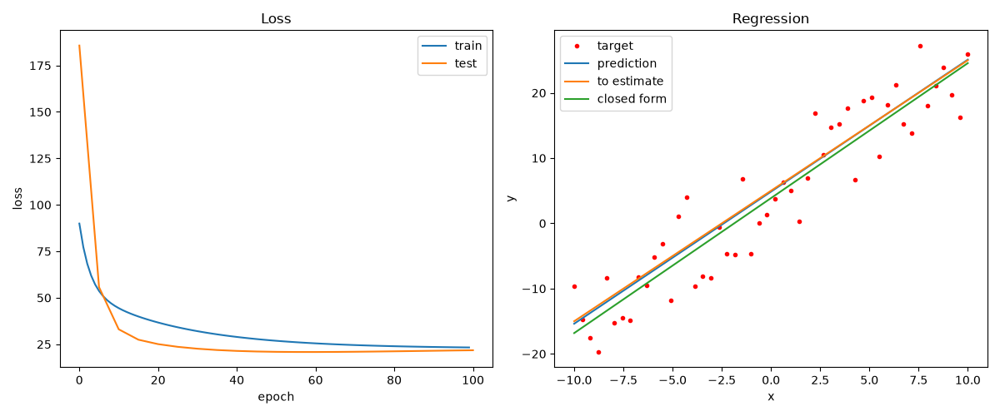
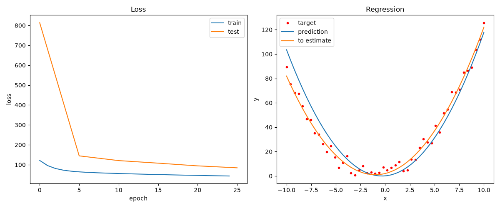
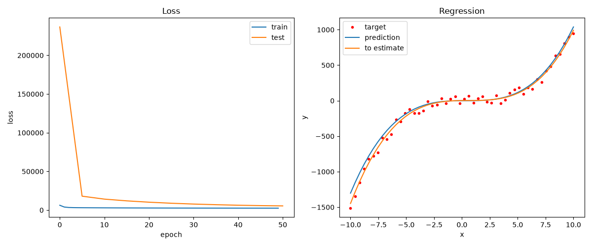

# Polynomial Regression

A family of regression examples built on top of **tiny-torch**, all solving the
same problem at increasing polynomial degree: recover the coefficients of an
unknown function from noisy `(x, y)` pairs, using a single `Linear` layer
trained by gradient descent.

| Example | Function to estimate | Model | Details |
|---|---|---|---|
| [`linear/`](./linear) | `2·x + 5` | `Linear(1, 1)` | [README](./linear/README.md) |
| [`quadratic/`](./quadratic) | `x² + 2·x + 2` | `Linear(2, 1)` | [README](./quadratic/README.md) |
| [`cubic/`](./cubic) | `1.2·x³ − 2.3·x² + 2·x + 2` | `Linear(3, 1)` | `cubic.py` |

Every example follows the same recipe: build a noisy dataset on `[-5, 5]`,
train with `MSELoss` + `SGD`, then evaluate on the wider `[-10, 10]` to check
that the model *extrapolates* instead of memorizing.

---

## Differences between polynomials

The `in_features` of the `Linear` layer must be equal to the degree of the
polynomial — the model has to be able to learn every ingredient that forms it:

- **Linear case:** `Linear(in_features=1, out_features=1)` → `y = w·x + b`
- **Quadratic case:** `Linear(in_features=2, out_features=1)` → `y = w₁·x + w₂·x² + b`
- **Cubic case:** `Linear(in_features=3, out_features=1)` → `y = w₁·x + w₂·x² + w₃·x³ + b`

One `in_feature` for each degree of freedom of the function we want to
estimate (the constant term is always covered by the bias).

The model itself stays linear in every case. What changes is the **feature
expansion**: instead of feeding the raw scalar `x`, we feed the vector of its
powers, built with `np.hstack`:

```python
# quadratic: [x, x²]
X_train = Tensor(np.hstack([train_domain, train_domain**2]))

# cubic: [x, x², x³]
X_train = Tensor(np.hstack([train_domain, train_domain**2, train_domain**3]))
```

Over the expanded features the problem is an ordinary affine map, so the MSE
loss stays **convex** and plain SGD is guaranteed to converge to the global
optimum — regardless of how non-linear the curve looks in `x`.

## The learning rate must shrink with the degree

Higher powers of `x` produce much larger feature values (on the train split
`x³` reaches `125` while `x` stops at `5`), and therefore much larger
gradients. To keep the updates from overshooting, each extra degree costs
roughly a 10× smaller learning rate:

| Degree | Learning rate |
|---|---|
| 1 (linear) | `1e-2` |
| 2 (quadratic) | `1e-3` |
| 3 (cubic) | `1e-4` |

An alternative would be to normalize the features so every power lives on a
comparable scale — then a single learning rate would work for all degrees.

---

## Results

The same story at every degree: the loss converges, and on the wider test
domain the learned curve tracks the true polynomial — the model recovered the
coefficients, not the data points.

### Linear — `2·x + 5`



### Quadratic — `x² + 2·x + 2`



### Cubic — `1.2·x³ − 2.3·x² + 2·x + 2`



---

## Run them

```bash
python examples/linear_regression/linear/linear.py
python examples/linear_regression/quadratic/quadratic.py
python examples/linear_regression/cubic/cubic.py
```
