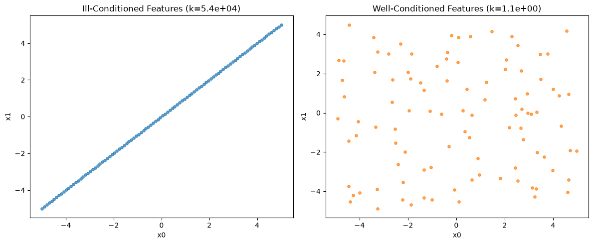
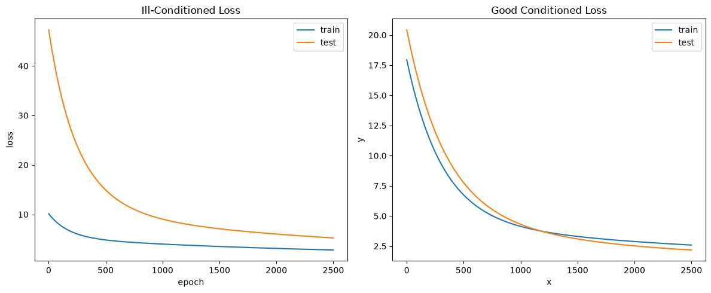
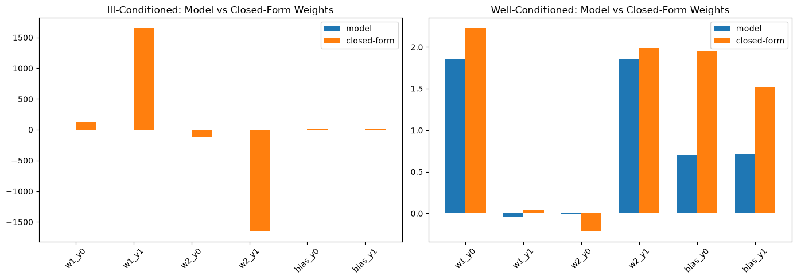

# Ill-Conditioned Linear Regression

An experiment built on top of **tiny-torch** that shows why a linear
regression model can look like it is fitting well — low prediction error —
while its learned coefficients are almost meaningless. The culprit is the
**condition number** of the input features: when two features are nearly
collinear (multicollinearity), the loss surface stops having a single sharp
minimum and turns into a long, shallow valley. Many different combinations of
weights sit at essentially the same loss, so gradient descent (and even the
closed-form solution) can land on wildly different coefficients depending on
noise, initialization, or numerical error — even though every one of them
predicts almost as well as the rest.

The function used to generate targets is:

```
f(X) = 2·X + 2      (applied elementwise to a 2-feature input)
```

Two datasets are built from the same `f`, differing only in how the two input
features relate to each other, and a model is trained on each so their
behavior can be compared side by side.

---

## The two datasets

**Ill-conditioned.** The second feature is built as a near-copy of the first:

```python
x = np.linspace(-5, 5, DATASET_SIZE)
y = x + EPS * rng.standard_normal(DATASET_SIZE)   # EPS = 1e-4
X = np.stack([x, y]).T
```

`y` tracks `x` almost exactly, with only a tiny amount of independent noise
(`EPS = 1e-4`) breaking the perfect correlation. The resulting design matrix
has a measured condition number of **k(X) ≈ 53,975** — the two columns are
nearly linearly dependent.

**Well-conditioned.** The two features are drawn independently:

```python
x = rng.uniform(-5, 5, DATASET_SIZE)
y = rng.uniform(-5, 5, DATASET_SIZE)
X = np.stack([x, y]).T
```

With no relationship between the columns, the condition number drops to
**k(X) ≈ 1.07** — about as well-behaved as a design matrix gets.

Both datasets are otherwise identical: `100` samples, targets computed as
`f(X)` and then perturbed with uniform noise (`NOISE = 2`), and split 90% / 10%
into train and test tensors, each wrapped in a `TensorDataset` + `DataLoader`
(full-batch) for the `Trainer`.



The scatter plots make the difference visible directly: the ill-conditioned
features collapse onto a single line (`x1 ≈ x0`), while the well-conditioned
features fill the plane with no discernible relationship.

---

## The model

Each dataset gets its own copy of the same architecture — a single `Linear`
layer with two inputs and two outputs — trained with plain SGD via a
`Trainer`:

```python
model = Sequential(Linear(2, 2))
loss = MSELoss()
optimizer = SGD(model.parameters, LR)   # LR = 1e-4
trainer = Trainer(model, loss, optimizer)
```

Two independent `Trainer`s (`trainer_ill` / `trainer_well`) run for
`EPOCHS = 2500`, logging the test loss every `EVAL_STEP = 5` epochs:

```python
for i, epoch in enumerate(range(EPOCHS)):
    _ = trainer.train_epoch(train_dataloader, 1)

    if i % EVAL_STEP == 0:
        _ = trainer.eval(test_dataloader)
```

`train_epoch()` runs the forward/backward/optimizer-step internally and logs
the loss into `trainer.history`; loss curves are read back from
`trainer.train_loss` / `trainer.eval_loss`.

The loss curves for both runs are plotted side by side to confirm that
training converges in both cases.



Both models converge smoothly, and their train/test loss curves look
unremarkable — nothing in this plot hints that anything is wrong with the
ill-conditioned run.

---

## Measuring the damage: predictions vs. weights

Convergence of the loss alone doesn't reveal the problem — both models drive
their loss down. The experiment instead compares each trained model against
the **closed-form least-squares solution** (`np.linalg.lstsq`) computed on the
held-out test set, on two axes:

- **Prediction residual** — `mse(model_predictions, closed_form_predictions)`
- **Weights residual** — `mse(model_weights, closed_form_weights)`

If the model has learned *the* coefficients, both residuals should be small.

### Ill-conditioned results

```
prediction residual: 3.54
weights residual:    8,770,009.37
```

### Well-conditioned results

```
prediction residual: 1.52
weights residual:    0.42
```

(Exact figures vary run to run — the noise added to the targets is drawn from
an unseeded generator — but the multiple-orders-of-magnitude gap between the
two weight residuals is consistent.)

The prediction residual is in the same ballpark for both datasets — both
models make comparable predictions. The weights residual tells a completely
different story: on the ill-conditioned data it is off by **several orders of
magnitude**, while on the well-conditioned data it stays small and consistent
with the closed-form solution.



Plotting the model's learned weights against the closed-form coefficients
makes the gap obvious: on the well-conditioned dataset the two bars for each
weight line up almost exactly, while on the ill-conditioned dataset the model
and the closed-form solution disagree wildly on the individual weights —
even swinging in opposite directions — despite both fitting the data about
equally well.

---

## Why it happens

When two features are nearly collinear, infinitely many `(w₁, w₂)` pairs
along the direction of collinearity produce almost the same predictions —
because `w₁·x + w₂·y ≈ w₁·x + w₂·x = (w₁ + w₂)·x` when `y ≈ x`. The loss only
constrains the *sum* `w₁ + w₂` tightly; how that sum is split between the two
weights is barely constrained at all, so both gradient descent and the exact
`lstsq` solver are free to settle on very different individual coefficients
while producing nearly identical output. That is exactly what the huge weight
residual captures: not a training failure, but a fundamentally
**ill-posed estimation problem**.

This is the practical danger of multicollinearity: a model can pass every
predictive check on held-out data and still have coefficients that are not
trustworthy — flipping sign, exploding in magnitude, or changing drastically
with small perturbations to the data — which matters whenever the *coefficients
themselves* (not just the predictions) are meant to be interpreted.

In production, that collinearity can break for any reason — a sensor outage,
or simply a shift in operating conditions. A model that seemed to rely on
stable, interpretable coefficients can see those coefficients swing wildly
once the correlation between features that held during training no longer
holds at inference time. Whenever the learned coefficients themselves need to
be interpreted, not just used for prediction, it's worth checking the
conditioning of your input features before trusting what a model has
"learned" about them.

---

## Run it

Open and run the notebook top to bottom:

```bash
jupyter notebook examples/linear_regression/linear-ill-cond/main.ipynb
```
