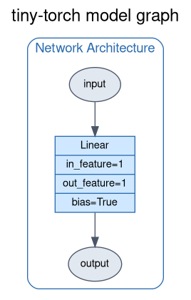
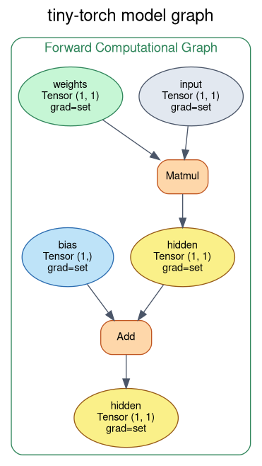
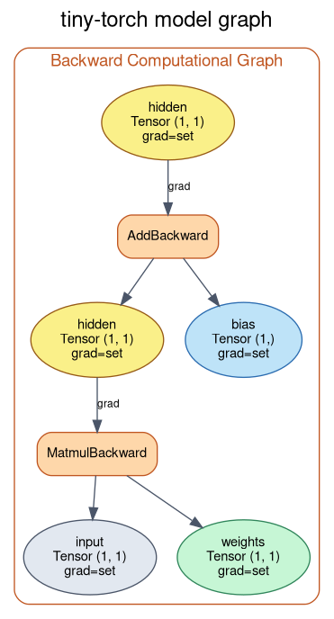

# Linear Regression

A naive linear regression built on top of **tiny-torch**. The goal is to recover
the two parameters of a straight line — the **slope** and the **intercept** —
directly from noisy data, using nothing but a single `Linear` layer trained by
gradient descent.

The function we try to estimate is:

```
f(x) = 2·x + 5   →   slope = 2, intercept = 5
```

The model never sees these numbers. It only sees `(x, y)` pairs (with noise added
to `y`) and has to *learn* the slope and intercept on its own.

---

## The model

The whole model is a single affine map `y = w·x + b`. In tiny-torch that is one
`Linear(1, 1)` layer: one input feature, one output feature, one weight (the
slope `w`) and one bias (the intercept `b`).

```python
model = Sequential(
    Linear(1, 1),   # one slope, one intercept
)
```

<table>
  <tr>
    <th>Architecture</th>
    <th>Forward pass</th>
    <th>Backward pass</th>
  </tr>
  <tr>
    <td></td>
    <td></td>
    <td></td>
  </tr>
</table>

- **Architecture.** A single `Linear` layer maps a scalar input to a scalar
  output. `bias=True` means the intercept is a trainable parameter too — without
  it the line would be forced through the origin.
- **Forward pass.** The forward pass is `y = x @ w + b`: a **Matmul** multiplies
  the input by the weight tensor (the slope), then an **Add** adds the bias (the
  intercept). Every node is a `Tensor` that records the operation that produced
  it, so the graph can be walked backwards later.
- **Backward pass.** Calling `.backward()` on the loss walks the graph in
  reverse. `AddBackward` and `MatmulBackward` distribute the gradient of the loss
  down to the two learnable tensors (`weights` and `bias`), which is exactly what
  the optimizer needs to nudge the slope and intercept in the right direction.

---

## The process

The training script (`linear.py`) does the following:

1. **Build the dataset.** Sample `x` on a line, compute `f(x)`, then add uniform
   noise to the targets so the problem is non-trivial. The train split lives on
   `[-5, 5]`, the test split on the wider `[-10, 10]` to check that the model
   *extrapolates* instead of memorizing.

2. **Compute a closed-form reference.** Using `np.linalg.lstsq` on the design
   matrix `[x, 1]` we solve for the optimal slope and intercept analytically.
   This is the best a linear model can possibly do, and it is what our gradient
   descent should converge towards.

3. **Train with a `Trainer`.** The train/test tensors are wrapped in a
   `TensorDataset` + `DataLoader` (full-batch), and a `Trainer` ties together
   the model, `MSELoss`, `SGD` and a `CosineSchedule` annealing the learning
   rate from `MAX_LR = 1e-1` to `MIN_LR = 1e-4`:
   ```python
   for i, epoch in enumerate(range(EPOCHS)):
       _ = trainer.train_epoch(train_dataloader, 1)

       if i % EVAL_STEP == 0:
           _ = trainer.eval(test_dataloader)
   ```
   `train_epoch()` runs the forward/backward/optimizer-step internally and
   logs the loss into `trainer.history`; `eval()` runs a no-grad pass over the
   test set every `EVAL_STEP` epochs.

4. **Plot.** The loss curves (`trainer.train_loss` / `trainer.eval_loss`) and
   the fitted line are drawn side by side.

> ⚠️ **Gotcha (see [`arch/WIL.md`](./arch/WIL.md)).** The prediction must be
> `model(x)`, not `model(y)`. Feeding `y` makes the model memorize the targets
> instead of learning the `x → y` relationship — that is not regression.

---

## Results


- **Left (Loss).** Both train and test loss fall smoothly and flatten out —
  gradient descent is converging. They settle just above the noise floor
  (`NOISY = 8`), which is expected: the model cannot do better than the noise we
  injected into the data.
- **Right (Regression).** The orange sawtooth is the noisy signal *to estimate*.
  The blue **prediction** line learned by tiny-torch sits right on top of the
  green **closed form** line and tracks the red **target** points. In other
  words, gradient descent recovered essentially the same slope and intercept as
  the analytic least-squares solution.

---

## Why it works

Linear regression with a mean-squared-error loss is a **convex** problem: the
loss surface over `(slope, intercept)` is a single bowl with one global minimum.
That means plain gradient descent, given a small enough learning rate, is
guaranteed to slide down to the optimum — the same point `lstsq` computes in
closed form.

The `Linear(1, 1)` layer is exactly the hypothesis class `y = w·x + b`, so the
parameters it learns *are* the slope and intercept by construction. The
autograd engine computes the exact gradients of the MSE with respect to `w` and
`b`, and SGD follows them downhill. The result is a model that matches the
analytic solution without ever being told the true `2·x + 5`.

---

## Run it

```bash
python examples/linear_regression/linear/linear.py
```

You can regenerate the architecture diagrams by uncommenting the
`model.save_graph(...)` lines in the script.
