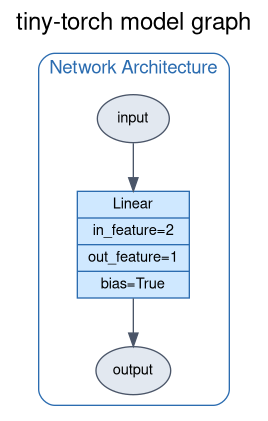
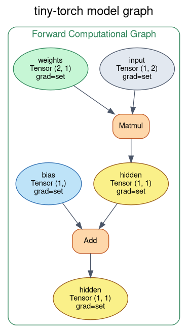
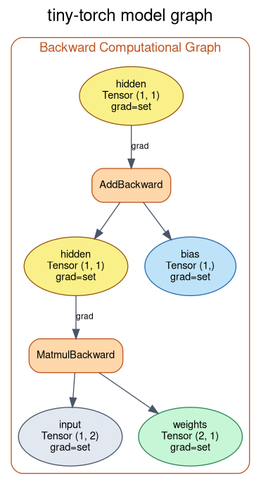

# Quadratic Regression

A quadratic regression built on top of **tiny-torch**. The goal is to recover
the three coefficients of a parabola directly from noisy data — and to show
that a *linear* model can fit a *non-linear* curve, as long as we hand it the
right features.

The function we try to estimate is:

```
f(x) = x² + 2·x + 2   →   a = 1, b = 2, c = 2
```

The model never sees these numbers. It only sees `(x, y)` pairs (with noise
added to `y`) and has to *learn* the coefficients on its own.

---

## The model

The trick is **feature expansion**: instead of feeding the model the raw scalar
`x`, we feed it the vector `[x, x²]`. The problem then becomes linear again —
`y = w₁·x + w₂·x² + b` is an affine map over the expanded features — so a
single `Linear(2, 1)` layer is enough: two input features, one output, two
weights (the linear and quadratic coefficients) and one bias (the constant
term).

```python
X_train = Tensor(np.hstack([train_domain, train_domain**2]))  # [x, x²]

model = Sequential(
    Linear(2, 1),   # w₁·x + w₂·x² + b
)
```

<table>
  <tr>
    <th>Architecture</th>
    <th>Forward pass</th>
    <th>Backward pass</th>
  </tr>
  <tr>
    <td></td>
    <td></td>
    <td></td>
  </tr>
</table>

- **Architecture.** A single `Linear` layer maps the two-dimensional feature
  vector `[x, x²]` to a scalar output. `bias=True` gives the parabola its
  constant term `c`.
- **Forward pass.** The forward pass is `y = X @ w + b`: a **Matmul**
  multiplies the feature matrix by the weight tensor (the two coefficients),
  then an **Add** adds the bias. Every node is a `Tensor` that records the
  operation that produced it, so the graph can be walked backwards later.
- **Backward pass.** Calling `.backward()` on the loss walks the graph in
  reverse. `AddBackward` and `MatmulBackward` distribute the gradient of the
  loss down to the two learnable tensors (`weights` and `bias`), which is
  exactly what the optimizer needs to nudge all three coefficients in the
  right direction.

---

## The process

The training script (`quadratic.py`) does the following:

1. **Build the dataset.** Sample `x` on a line, compute `f(x)`, then add
   uniform noise to the targets so the problem is non-trivial. The raw inputs
   are expanded into `[x, x²]` with `np.hstack`. The train split lives on
   `[-5, 5]`, the test split on the wider `[-10, 10]` to check that the model
   *extrapolates* instead of memorizing — extrapolation is much harder here,
   because on `[-10, 10]` the `x²` term grows to values the model never saw
   during training.

2. **Train with a `Trainer`.** The train/test tensors are wrapped in a
   `TensorDataset` + `DataLoader` (full-batch), and a `Trainer` ties together
   the model, `MSELoss`, `SGD` and a `CosineSchedule` annealing the learning
   rate from `MAX_LR = 1e-3` to `MIN_LR = 1e-6`:
   ```python
   for i, epoch in enumerate(range(EPOCHS)):
       _ = trainer.train_epoch(train_dataloader, 1)

       if i % EVAL_STEP == 0:
           _ = trainer.eval(test_dataloader)
   ```
   `train_epoch()` runs the forward/backward/optimizer-step internally and
   logs the loss into `trainer.history`; `eval()` runs a no-grad pass over the
   test set every `EVAL_STEP` epochs.

3. **Plot.** The loss curves (`trainer.train_loss` / `trainer.eval_loss`) and
   the fitted parabola are drawn side by side.

> ⚠️ **Gotcha.** The peak learning rate here is `1e-3`, two orders of
> magnitude smaller than in the simple example. The `x²` feature reaches
> values up to `25` on the train split, so its gradients are much larger than
> those of the raw `x` — a bigger learning rate makes the updates on the
> quadratic weight overshoot and the loss diverge.

---

## Results


- **Left (Loss).** Both train and test loss fall and flatten out — gradient
  descent is converging. The test loss sits higher than the train loss: on the
  wider `[-10, 10]` domain even a small error in the quadratic coefficient is
  amplified by `x²`.
- **Right (Regression).** The **prediction** curve learned by tiny-torch tracks
  the **to estimate** parabola and the noisy red **target** points, including
  outside the training interval — evidence that the model learned the
  coefficients, not the data points.

---

## Why it works

By expanding the input to `[x, x²]`, quadratic regression becomes ordinary
linear regression over the feature space. With a mean-squared-error loss this
is a **convex** problem: the loss surface over `(w₁, w₂, b)` is a single bowl
with one global minimum, so plain gradient descent, given a small enough
learning rate, is guaranteed to slide down to the optimum.

The `Linear(2, 1)` layer is exactly the hypothesis class
`y = w₁·x + w₂·x² + b`, so the parameters it learns *are* the parabola's
coefficients by construction. The autograd engine computes the exact gradients
of the MSE with respect to the weights and bias, and SGD follows them downhill
— recovering the true `x² + 2·x + 2` without ever being told it.

This is the core idea behind **polynomial regression** and, more broadly,
basis-function methods: the model stays linear, and all the non-linearity is
pushed into the features.

---

## Run it

```bash
python examples/linear_regression/quadratic/quadratic.py
```

You can regenerate the architecture diagrams via the `model.save_graph(...)`
lines in the script.
